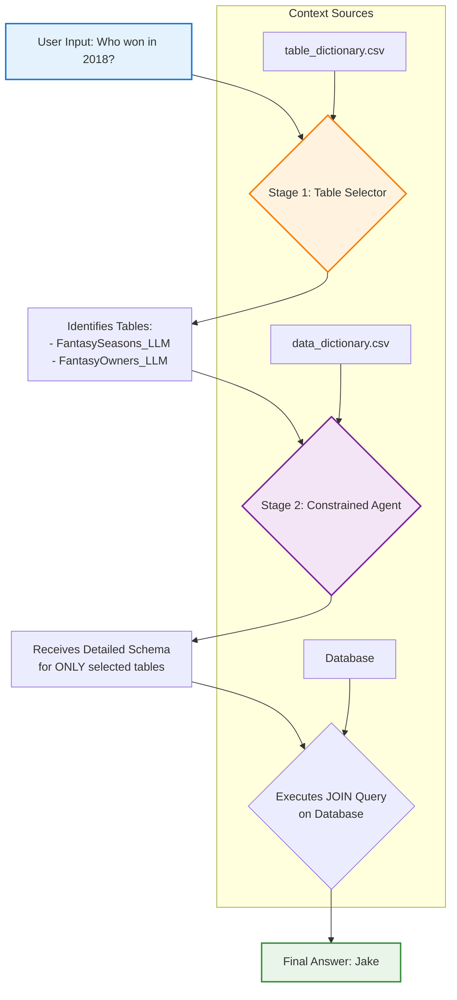

# 🏈 Fantasy Football Oracle

> An advanced, conversational AI chatbot designed to answer questions about fantasy football league history through intelligent SQL database querying.

## 📋 Table of Contents
- [✨ Features](#-features)
- [🏗️ Core Architecture](#️-core-architecture)
- [🔄 How It Works: Step-by-Step Example](#-how-it-works-step-by-step-example)
- [⚙️ Technical Stack](#️-technical-stack)
- [🚀 Setup and Installation](#-setup-and-installation)
- [📁 Project Structure](#-project-structure)
- [🐛 Logging and Debugging](#-logging-and-debugging)

## ✨ Features

### 🗣️ Natural Language Queries
Ask complex questions in plain English:
- *"Who had the most passing yards in 2019?"*
- *"What was my win/loss record against Jake?"*
- *"Show me the top scorers from last season"*

### 💬 Conversational Context
The chatbot remembers previous conversation turns, enabling natural follow-up questions:
- **You:** *"Who won the league in 2018?"*
- **Oracle:** *"Jake won the championship in 2018"*
- **You:** *"What was their team name?"*
- **Oracle:** *"Jake's team was called 'The Juggernauts'"*

### ⚡ Performance & Reliability
- **Fast Response Times:** Utilizes intelligent caching for quick answers after initial startup
- **High Accuracy:** Multi-step agentic workflow prevents errors and ensures reliable results
- **Self-Correcting:** Automatically handles and recovers from SQL errors

### 🔍 Transparent Debugging
- **Agent's Internal Context:** Expandable UI section showing exactly what information the AI used
- **Full Traceability:** Complete visibility into the decision-making process

## 🏗️ Core Architecture

The application's strength lies in its **two-stage "Constrained Agent" architecture**. Instead of giving a powerful AI agent free access to the entire database (which is slow and error-prone), we intelligently break the problem into two focused steps:



### 🎯 Stage 1: The Database Router (Table Selector)

A lightweight, specialized LLM call that acts as an intelligent "database router."

**Input:**
- User's question
- Conversation history
- High-level table dictionary (`table_dictionary.csv`)

**Process:**
1. Analyzes user intent and question complexity
2. Identifies the **minimal set of tables** required
3. Considers relationships between tables (e.g., "who won?" needs both seasons and owners tables)

**Output:**
- Simple comma-separated list of required table names
- Example: `FantasySeasons_LLM,FantasyOwners_LLM`

> **Why This Matters:** This pre-filtering step is crucial for both performance and accuracy. It prevents the final agent from being overwhelmed with dozens of irrelevant table schemas.

### 🤖 Stage 2: The Constrained SQL Agent

The main "worker" agent operating under strict, dynamically-generated constraints.

**Dynamic Context Loading:**
- Agent is initialized fresh for each query
- Receives only the detailed schema for Stage 1's selected tables
- Schema loaded from rich `data_dictionary.csv` with semantic context

**Methodical Reasoning (ReAct Framework):**
1. **Think:** Formulate approach to the problem
2. **Act:** Execute SQL query or other action
3. **Observe:** Analyze results
4. **Repeat:** Continue until question is answered

**Self-Correction Capabilities:**
- Analyzes database error messages
- Automatically corrects faulty SQL queries
- Ensures high system resilience

## 🔄 How It Works: Step-by-Step Example

Let's trace through a complete query: **"Who won the championship in 2018?"**

### 1. 🚪 Simple Router Check
```
Input: "Who won the championship in 2018?"
Result: Not a simple greeting → Continue to Table Selector
```

### 2. 🎯 Table Selector (Stage 1)
```
Input: User question + table descriptions
Reasoning: 
  - "who" implies a person's name → need FantasyOwners_LLM table
  - "championship in 2018" → need FantasySeasons_LLM table
Output: ['FantasySeasons_LLM', 'FantasyOwners_LLM']
```

### 3. 📋 Schema Injection
```
Process: Read data_dictionary.csv
Result: Build detailed schema string for ONLY the 2 selected tables
```

### 4. 🤖 Constrained Agent (Stage 2)
```
Agent receives focused schema and begins ReAct process:

💭 Thought 1: "I need to find the winner's name. I can get the champion_owner_id 
   from FantasySeasons_LLM where season_id is 2018, then JOIN with FantasyOwners_LLM 
   to get the name."

🔧 Action: sql_db_query
   Query: SELECT T2.owner_name 
          FROM FantasySeasons_LLM AS T1 
          JOIN FantasyOwners_LLM AS T2 ON T1.champion_owner_id = T2.owner_id 
          WHERE T1.season_id = 2018

👀 Observation: [('Jake',)]

💭 Thought 2: "Perfect! I have the result 'Jake'. This directly answers the user's question."

✅ Final Answer: Jake
```

### 5. 🧠 Memory Update
```
Process: Save user question and AI answer to conversation memory
Result: Context available for future follow-up questions
```

## ⚙️ Technical Stack

| Component | Technology | Purpose |
|-----------|------------|---------|
| **Framework** | [Streamlit](https://streamlit.io/) | Web application and UI |
| **LLM Orchestration** | [LangChain](https://www.langchain.com/) | Agent management and workflows |
| **LLM Provider** | [Google Gemini](https://ai.google.dev/) | Large language model API |
| **Database** | SQLite | Local database storage |
| **Interface** | Streamlit Chat | Conversational user interface |

## 🚀 Setup and Installation

### Prerequisites
- Python 3.8+
- Google API key for Gemini

### Installation Steps

1. **Clone the repository:**
   ```bash
   git clone https://github.com/your-username/fantasy-chatbot.git
   cd fantasy-chatbot
   ```

2. **Create and activate virtual environment:**
   ```bash
   python -m venv venv
   
   # On macOS/Linux:
   source venv/bin/activate
   
   # On Windows:
   venv\Scripts\activate
   ```

3. **Install dependencies:**
   ```bash
   pip install -r requirements.txt
   ```

4. **Configure environment variables:**
   
   Create a `.env` file in the root directory:
   ```env
   GOOGLE_API_KEY="your_api_key_here"
   ```

5. **Launch the application:**
   ```bash
   streamlit run app.py
   ```

6. **Access the app:**
   Open your browser to `http://localhost:8501`

## 📁 Project Structure

```
fantasy-football-oracle/
├── 🔧 .env                     # Environment variables (GOOGLE_API_KEY)
├── 📖 README.md                # This documentation
├── 📦 requirements.txt         # Python dependencies
├── 🏠 app.py                   # Main Streamlit application and agent logic
├── 🗄️ llm_fantasy_data.db      # SQLite database with fantasy data
├── 📊 table_dictionary.csv     # High-level table descriptions (Stage 1)
├── 📋 data_dictionary.csv      # Detailed column descriptions (Stage 2)
└── 🐛 agent_debug.log          # Comprehensive debugging log
```

### Key Files Explained

- **`app.py`**: Main application containing the Streamlit interface, agent logic, and workflow orchestration
- **`llm_fantasy_data.db`**: SQLite database containing all fantasy football league data
- **`table_dictionary.csv`**: High-level table descriptions used by the Table Selector (Stage 1)
- **`data_dictionary.csv`**: Detailed column descriptions and semantic context for the SQL Agent (Stage 2)

## 🐛 Logging and Debugging

The application provides comprehensive debugging capabilities:

### 📄 Log Files
- **`agent_debug.log`**: Detailed log recording every step of the agent's reasoning process
  - Full context received by each agent
  - Every action taken and observation made
  - Error messages and recovery attempts
  - Performance metrics and timing

### 🔍 In-App Debugging
- **"Agent's Internal Context" Expander**: Available for every query in the UI
  - Shows selected tables from Stage 1
  - Displays schema information provided to Stage 2
  - Real-time insight into agent decision-making
  - No need to check log files for basic debugging

### 🎯 Debug Information Includes
- Table selection reasoning
- Schema injection details
- SQL query generation process
- Error handling and recovery steps
- Response time metrics

---

<div align="center">

**🏆 Ready to dominate your fantasy league with data-driven insights?**

*Get started by running the application and asking your first question!*

</div>
